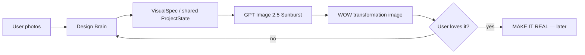

# RUINFORM — MVP ROADMAP

> Living document. Update this file when product direction changes.

## North Star

A person photographs discarded / ordinary real objects and RUINFORM turns them into a **desirable post-apocalyptic design object** that still visibly comes from those real source materials.

MVP success is one sentence:

**UPLOAD REAL JUNK → GET A WOW OBJECT → WANT TO BUILD IT.**

The product is not trying to make generic AI art. It is building a post-apocalyptic reuse economy around real matter.

---

## Current MVP scope

For now we deliberately focus on only two jobs:

1. **Understand the uploaded photographs and source objects.**
2. **Generate one genuinely strong transformation image.**

Everything else is secondary until this loop produces a consistent wow effect.



---

## Minimal architecture

### 1. Shared ProjectState

One source of truth. Agents/modules do **not** pass lossy summaries to each other as the only context.

ProjectState keeps:

- original source photos
- material IDs
- material observations
- user goal / optional intent
- constraints
- selected concept
- visual direction
- generated image
- later: approved image + build plan

Every visual intelligence step that needs the originals receives the original photos again.

### 2. Design Brain

Primary reasoning model: OpenAI reasoning/vision model.

Responsibilities:

- understand source objects
- invent the transformation
- preserve provenance
- enforce RUINFORM visual taste
- create one strong VisualSpec
- avoid generic AI decoration

### 3. Image Engine

**PRIMARY: GPT-Image-2.5 Sunburst**

Reasons:

- direct image inputs
- generation + editing
- high source fidelity
- fewer translation layers between reasoning and image creation

**PARKED / BENCHMARK: Higgsfield**

Keep adapter code but remove it from the default MVP path.

### 4. Build Brain — later

Only after visual quality is consistently strong.

Input:

- original photos
- ProjectState
- approved final render

Output:

- shopping list
- tools
- preflight
- build steps
- safety gates
- final visual verification

---

## RUINFORM visual identity

The missing ingredient is not “more cyberpunk”.

The target is **post-apocalyptic design from real discarded matter**.

Core taste rules:

- original material provenance must remain visible
- one hero object
- one memorable transformation gesture
- strong silhouette
- tension between materials (soft/hard, damaged/pristine, exposed/protected, industrial/domestic)
- intentional asymmetry and negative space when useful
- believable matter, seams, wear, folds, glass, metal, plastic
- object first, background second
- no generic RGB decoration as a substitute for an idea
- no “AI 2023” glossy random collage

The result should feel like a discovered artifact from a functioning post-collapse workshop, photographed today by a great designer.

---

## Taste Library — planned bucket

We will create a curated visual reference library. This is **not** training a new model. It is retrieval-based taste calibration.

Suggested buckets:

```text
/taste-library
    /lighting
    /lamps
    /wall-art
    /sculpture
    /furniture
    /storage
    /wearables
    /small-objects
    /materials
    /backgrounds
    /post-apocalyptic-world
```

Each approved reference should eventually carry metadata:

```json
{
  "category": "lighting",
  "why_good": [
    "strong silhouette",
    "visible reclaimed source",
    "one material tension",
    "believable construction"
  ],
  "avoid_copying": [
    "exact geometry",
    "brand identity"
  ],
  "tags": ["industrial", "worn", "asymmetric", "warm-light"]
}
```

At generation time the Design Brain should receive a **small relevant selection**, not the whole library.

---

## Build sequence

### RFM-INT-0008 — GPT Image primary renderer

- [x] Add GPT Image provider
- [x] Keep Higgsfield adapter as fallback
- [x] Make OpenAI the default render provider
- [ ] Run same bottle / jacket / LED test through GPT Image
- [ ] Compare against Higgsfield visually
- [ ] Record result in Failure / Success Library

**Gate:** GPT result must materially exceed the previous Higgsfield outputs in coherence, authorship and source fidelity.

### RFM-INT-0009 — Taste Library v0

- [ ] Define first 20–30 approved reference images
- [ ] Split into categories
- [ ] Add short `why_good` metadata
- [ ] Retrieve 2–4 relevant references per project
- [ ] Feed those references to Design Brain / image step

**Gate:** the same source photos produce visibly RUINFORM-looking results across several categories.

### RFM-INT-0010 — RUINFORM World / Background Language

- [ ] Define 3–5 photographic environments
- [ ] Workshop / bunker / salvage gallery / abandoned domestic / clean artifact documentation
- [ ] Keep background subordinate to object

### RFM-INT-0011 — Async generation UX

Only after image quality works.

- [ ] submit render job
- [ ] persist job_id/state
- [ ] progress screen
- [ ] polling / completion
- [ ] no long browser request

### RFM-INT-0012 — Waiting experience

Parked until core generation succeeds.

Idea: a small post-apocalyptic salvage game using a proven simple game mechanic with original RUINFORM models/assets/location.

Stages can map to real backend work:

- SCANNING MATTER
- FINDING FORM
- BUILDING ARTIFACT
- SYNTHESIZING IMAGE
- FINALIZING FUTURE

### RFM-INT-0013 — MAKE IT REAL

Resume Build Master only after the image is worth building.

---

## What we deliberately do NOT build yet

- large multi-agent swarm
- custom foundation model
- fine-tuning
- complex game
- marketplace
- token / economy layer
- social feed
- full manufacturing system
- endless critic → regenerate loops

These may come later. They are not allowed to distract from the current product proof.

---

## Current decision log

- Render.com remains hosting / deployment infrastructure, not an image model.
- GPT Image becomes the primary image renderer.
- Higgsfield is parked, not deleted.
- Shared ProjectState remains the central architecture.
- Original photos must remain available to visual stages.
- RUINFORM needs a curated Taste Library rather than ever-longer negative prompts.
- Post-apocalyptic reuse economy is the core world and product identity.
- Waiting-game idea is recorded but explicitly postponed.
