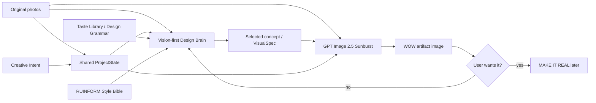

# RUINFORM — MVP ROADMAP

> Living document. Update this file whenever product direction changes.

## North Star

A person photographs discarded / ordinary real objects and RUINFORM turns them into a **desirable post-consumer / post-apocalyptic design object** that still visibly comes from those real source materials.

**UPLOAD REAL JUNK → GET A WOW OBJECT → WANT TO BUILD IT.**

The product is not generic AI art. It is a post-consumer salvage economy around real matter.

---

## Hackathon scope lock

For the hackathon we deliberately focus on one undeniable proof:

1. wow landing page / world
2. upload 2–4 real source photos
3. vision-first Design Brain sees the actual photos
4. four strong concept futures
5. GPT Image 2.5 Sunburst renders the selected future
6. source → future result presentation
7. closed / quota-controlled testing to protect API spend

Everything else is roadmap until this path creates reliable wow.

---

## Minimal architecture

### Shared ProjectState

One source of truth. Modules do not rely on lossy summaries as their only context.

Keep:
- original source photos
- material IDs / observations
- persistent Creative Intent
- difficulty mode
- background mode
- constraints
- selected concept
- visual direction
- generated image
- later: approved image + build plan

Any visual module that needs the originals receives the original photos again.

### Creative Intent

User guidance is a first-class ProjectState object, not a string appended to the image prompt.

Current controls:
- optional Creative Direction
- EASY / MEDIUM / WILD difficulty
- CLEAN STUDIO / RUINFORM WORLD presentation

Background mode is presentation-only: the object concept must work before scenery is added.

### Design Brain

Primary reasoning / vision brain.

Responsibilities:
- inspect original photographs directly
- understand source matter
- invent the transformation
- enforce RUINFORM world / taste
- reject obvious upcycling ideas
- preserve provenance
- create four distinct futures
- use persistent Creative Intent
- hand structured concept data forward

Wave 1 learned quality gates now promoted into the prompt/Skill:
- Signature Gesture
- Concept Compression
- Transformation Delta
- Physical Story
- WILD ≠ more parts
- neutral-background object test

Plugin-ready skill source:
`skills/ruinform-design-brain/SKILL.md`

Runtime prompt source:
`prompts/design_brain.md`

### Image Engine

**PRIMARY: GPT-Image-2.5 Sunburst**

- direct image inputs
- generation + editing
- strong visual synthesis
- fewer translation layers

**PARKED: Higgsfield**

Keep adapter for benchmark/fallback, but no longer default.

### Taste Library

A Design Grammar, not a moodboard and not fine-tuning.

The first 10 curated cards are now present:
- WATCHER — Mutate behavior
- LOADBEARER — Turn force into story
- WASTELIGHT — Recompose simply
- TRASHLIGHT — Reassign roles
- FLOATRELIC — Expose invisible force
- SWINGLIGHT — Turn function into character
- FOUNDLING — Discover latent form
- COINPOUR — Freeze the action
- HEARTWOOD — Remove to reveal
- TRILUME — Build through repetition

Current runtime uses the textual grammar. Next retrieval stage should select only 2–4 relevant cards/visual references per project rather than sending a growing library wholesale.

Structure and metadata rules:
`docs/TASTE_LIBRARY/README.md`

### Eval Library — current

A durable learning memory for real RUINFORM runs.

Each evaluation preserves a frozen snapshot of:
- source set
- Creative Direction / difficulty / background
- selected concept and review
- accepted render
- human outcome: success / mixed / fail
- idea / WOW / physical credibility / source participation / collectible scores
- would keep/build: yes / maybe / no
- GOOD / BAD notes
- reusable failure tags

Production storage uses PostgreSQL. Local development uses SQLite.

Studio appends a low-friction `TEACH RUINFORM` panel to approved renders and exposes a filterable library at `/studio/evals`.

Detailed contract:
`docs/EVAL_LIBRARY.md`

Taste Library teaches **what good design is**. Eval Library teaches **what happened when RUINFORM actually tried**.

### Build Brain — later

Only after `photos → image` reliably produces things worth building.

---

## Current build sequence

### RFM-INT-0008 — GPT Image primary

- [x] GPT Image provider
- [x] OpenAI renderer default
- [x] Higgsfield parked
- [x] First GPT Image bottle/jacket/LED test
- [x] Confirm renderer quality is cleaner but concept itself remains too literal

Learning: changing renderer alone is insufficient if the concept is weak.

### RFM-INT-0009 — Vision-first Design Brain

- [x] create RUINFORM Design Brain prompt
- [x] create plugin-ready Skill source
- [x] pass original photographs into concept generation
- [x] increase concept-stage creative reasoning priority
- [x] weight originality / artistic impact more strongly in preview ranking
- [x] rerun new real source sets from the beginning
- [x] judge concept quality before rendering

Learning: concept quality improved meaningfully; Visual Director / authorship is now a distinct bottleneck.

### RFM-INT-0010 — Taste Library micro-v0

- [x] create structure + README
- [x] curate first 10 references with user
- [x] add metadata / Design Operators
- [x] pass textual Design Grammar to Design Brain
- [ ] smart retrieval of only 2–4 relevant cards
- [ ] pass selected visual references to Design Brain / Visual Director

### RFM-INT-0011 — Production render path stabilization

- [x] GPT Image primary production path
- [x] normalize source images before OpenAI image generation
- [x] lock concept material IDs to actual ProjectState materials
- [x] verify real source → concepts → selected render path

### RFM-INT-0013 — LEARNING LOOP

#### Wave 1 — Creative Intent controls — COMPLETE

- [x] persistent Creative Direction in ProjectState
- [x] EASY / MEDIUM / WILD difficulty mode
- [x] CLEAN STUDIO / RUINFORM WORLD background mode
- [x] Design Brain receives Creative Intent
- [x] Visual Director receives Creative Intent
- [x] render prompt enforces object-first background contract
- [x] keep background mode from changing the core concept
- [x] user validation tests across EASY / MEDIUM / WILD and Clean / World A/B
- [x] promote Wave 1 quality lessons into Design Brain / Skill

#### Wave 2 — Eval Library v0 — CURRENT

- [x] EvalRecord structured schema
- [x] durable SQLite/PostgreSQL persistence
- [x] success / mixed / fail outcome
- [x] idea / WOW / physical / source / collectible scores
- [x] YES / MAYBE / NO keep-build signal
- [x] GOOD / BAD notes
- [x] reusable failure tags
- [x] Studio `TEACH RUINFORM` feedback form
- [x] `/studio/evals` ALL / SUCCESS / MIXED / FAIL views
- [ ] first production evaluation saved through UI
- [ ] accumulate 10 controlled real evaluation cases

#### Wave 3 — Smart retrieval

- [ ] structured material / form / operation features
- [ ] semantic retrieval over Design Operators
- [ ] diversity reranking
- [ ] retrieve 2–4 Taste Cards only
- [ ] retrieve 1–2 relevant past successes
- [ ] retrieve 1–2 relevant past failure patterns
- [ ] feed visual references when asset bucket is ready

### RFM-INT-0014 — 10 controlled real evaluation cases

For each case:
- upload source photos
- generate four concepts
- judge IDEA before rendering
- render only the strongest concept
- score IMAGE separately
- save Eval Library record

Target: at least 6–7 of 10 sets produce one concept that the user genuinely wants to see or build.

### RFM-INT-0015 — Hackathon landing / demo polish

- world-first landing
- controlled closed alpha
- source→future visual storytelling
- record one real end-to-end demo

Detailed plan:
`docs/RUINFORM_HACKATHON_DEMO.md`

### Later

- async generation UX
- waiting mini-game
- Build Master / MAKE IT REAL
- broader agent architecture
- marketplace / economy layer

---

## What we do NOT build yet

- giant multi-agent swarm
- custom foundation model
- fine-tuning
- full game
- marketplace
- token economy
- manufacturing system
- endless critic/regenerate loops

We use ready-made infrastructure wherever possible and write custom code only around RUINFORM's unique taste, state, transformation logic and UX.

---

## Decision log

- Render.com = hosting/deployment, not image intelligence.
- GPT Image is primary renderer.
- Higgsfield is parked, not deleted.
- Original photos must be available to concept and visual stages.
- One shared ProjectState remains central.
- Creative Direction is persistent project context, not a raw image prompt append.
- Background Mode changes presentation, not the object idea.
- RUINFORM Design Brain should be reusable as a Skill/Plugin brain.
- Taste Library first version = 10 distinct Design Operators.
- Eval Library is durable structured memory, not a markdown graveyard.
- Success, mixed and failure cases stay in one dataset with filterable views.
- Wave 3 retrieves only a small relevant memory pack, never the entire history.
- Post-consumer / post-apocalyptic salvage economy is core product identity.
- Hackathon uses closed/quota-controlled testing if necessary to protect API spend.
- Waiting mini-game is recorded but postponed.
