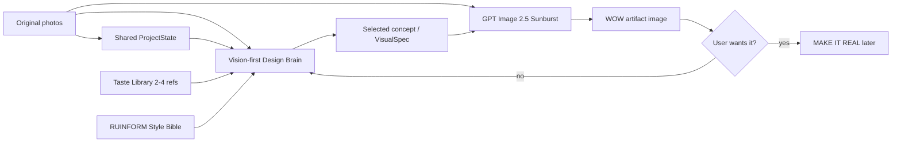

# RUINFORM — MVP ROADMAP

> Living document. Update this file whenever product direction changes.

## North Star

A person photographs discarded / ordinary real objects and RUINFORM turns them into a **desirable post-consumer / post-apocalyptic design object** that still visibly comes from those real source materials.

**UPLOAD REAL JUNK → GET A WOW OBJECT → WANT TO BUILD IT.**

The product is not generic AI art. It is a post-consumer salvage economy around real matter.

---

## Hackathon scope lock

For the hackathon we deliberately focus on one undeniable proof:

1. wow landing page / world
2. upload 2–4 real source photos
3. vision-first Design Brain sees the actual photos
4. four strong concept futures
5. GPT Image 2.5 Sunburst renders the selected future
6. source → future result presentation
7. closed / quota-controlled testing to protect API spend

Everything else is roadmap until this path creates reliable wow.

---

## Minimal architecture

### Shared ProjectState

One source of truth. Modules do not rely on lossy summaries as their only context.

Keep:
- original source photos
- material IDs / observations
- user intent
- constraints
- selected concept
- visual direction
- generated image
- later: approved image + build plan

Any visual module that needs the originals receives the original photos again.

### Design Brain

Primary reasoning / vision brain.

Responsibilities:
- inspect original photographs directly
- understand source matter
- invent the transformation
- enforce RUINFORM world / taste
- reject obvious upcycling ideas
- preserve provenance
- create four distinct futures
- hand structured concept data forward

Plugin-ready skill source:
`skills/ruinform-design-brain/SKILL.md`

Runtime prompt source:
`prompts/design_brain.md`

### Image Engine

**PRIMARY: GPT-Image-2.5 Sunburst**

- direct image inputs
- generation + editing
- strong visual synthesis
- fewer translation layers

**PARKED: Higgsfield**

Keep adapter for benchmark/fallback, but no longer default.

### Taste Library

Visual few-shot calibration, not fine-tuning.

Start with 6–10 excellent references, not 50 random images.

Retrieve 2–4 relevant references per project.

Structure and metadata rules:
`docs/TASTE_LIBRARY/README.md`

### Style Bible

World / material / photographic language:
`docs/RUINFORM_STYLE_BIBLE.md`

### Build Brain — later

Only after `photos → image` reliably produces things worth building.

---

## Current critical discovery

The old Concept Architect selected concepts from compact ProjectState text only. Original photographs were not shown until the later Visual Director stage.

That means a weak concept could be selected first and the renderer was then asked to make the weak idea beautiful.

**Decision:** concept generation becomes vision-first. The Design Brain must see the original photographs before selecting futures.

---

## Current build sequence

### RFM-INT-0008 — GPT Image primary

- [x] GPT Image provider
- [x] OpenAI renderer default
- [x] Higgsfield parked
- [x] First GPT Image bottle/jacket/LED test
- [x] Confirm renderer quality is cleaner but concept itself remains too literal

Learning: changing renderer alone is insufficient if the concept is weak.

### RFM-INT-0009 — Vision-first Design Brain

- [x] create RUINFORM Design Brain prompt
- [x] create plugin-ready Skill source
- [x] pass original photographs into concept generation
- [x] increase concept-stage creative reasoning priority
- [x] weight originality / artistic impact more strongly in preview ranking
- [ ] rerun same real source set from the beginning
- [ ] judge concept quality before rendering

**Gate:** at least one of four concepts should feel meaningfully non-obvious before image generation.

### RFM-INT-0010 — Taste Library micro-v0

- [x] create structure + README
- [ ] curate first 6–10 references with user
- [ ] add metadata
- [ ] retrieve 2–4 relevant refs per concept request
- [ ] pass selected refs to Design Brain

### RFM-INT-0011 — 5–10 real evaluation cases

For each case capture:
- source photos
- chosen concept
- final image
- wow score
- provenance score
- originality score
- build desire yes/no
- failure note

### RFM-INT-0012 — Hackathon landing / demo polish

- world-first landing
- controlled closed alpha
- source→future visual storytelling
- record one real end-to-end demo

Detailed plan:
`docs/RUINFORM_HACKATHON_DEMO.md`

### Later

- async generation UX
- waiting mini-game
- Build Master / MAKE IT REAL
- broader agent architecture
- marketplace / economy layer

---

## What we do NOT build yet

- giant multi-agent swarm
- custom foundation model
- fine-tuning
- full game
- marketplace
- token economy
- manufacturing system
- endless critic/regenerate loops

We use ready-made infrastructure wherever possible and write custom code only around RUINFORM's unique taste, state, transformation logic and UX.

---

## Decision log

- Render.com = hosting/deployment, not image intelligence.
- GPT Image is primary renderer.
- Higgsfield is parked, not deleted.
- Original photos must be available to concept and visual stages.
- One shared ProjectState remains central.
- RUINFORM Design Brain should be reusable as a Skill/Plugin brain.
- Taste Library starts small: 6–10 curated references.
- Post-consumer / post-apocalyptic salvage economy is core product identity.
- Hackathon uses closed/quota-controlled testing if necessary to protect API spend.
- Waiting mini-game is recorded but postponed.
